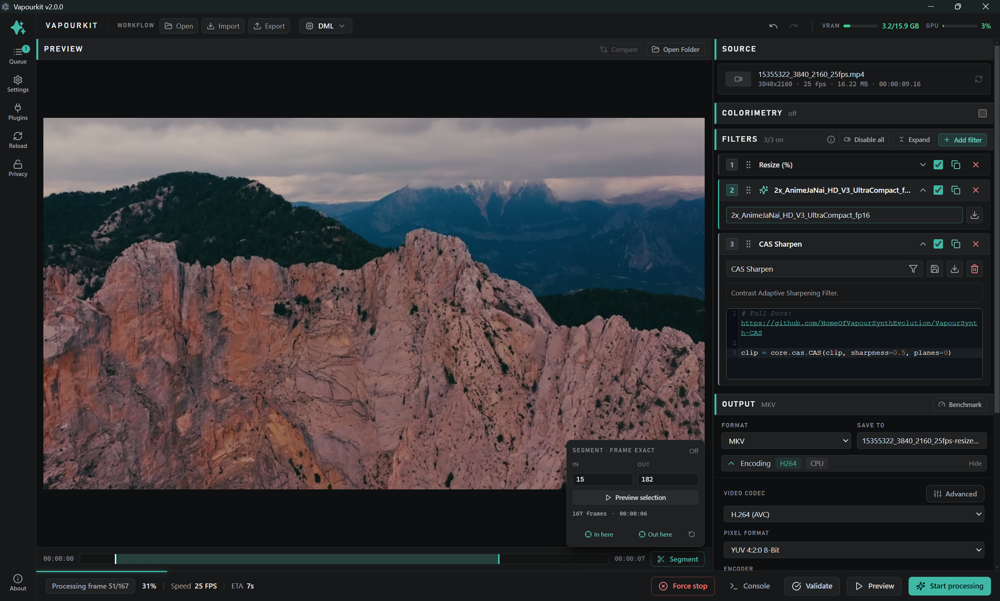

# Vapourkit

**Vapourkit** is a free, open-source application for upscaling and enhancing videos with VapourSynth and AI models. It runs on **Windows and Linux**, with inference backends varying by operating system:

- **Windows:** TensorRT for NVIDIA GPUs, DirectML for AMD/Intel/NVIDIA GPUs, and NCNN Vulkan.
- **Linux:** NCNN Vulkan on GPUs with a working Vulkan driver, and TensorRT on NVIDIA GPUs with a compatible CUDA/TensorRT stack. DirectML is Windows-only.

## Getting Started

### Installation
[Download Vapourkit](https://ko-fi.com/s/2e5ebd456d)

Linux testing builds are available on the [nightly releases page](https://github.com/Kim2091/vapourkit-nightly/releases).

#### Windows

1. Download Vapourkit and extract the archive or run the installer.
2. On first launch, click **Start Setup** when prompted to install dependencies.

#### Linux (x86_64 AppImage)

1. Install the host prerequisites listed below.
2. Make the downloaded AppImage executable: `chmod +x Vapourkit-*.AppImage`.
3. Run it with `./Vapourkit-*.AppImage`, then click **Start Setup** when prompted.

The AppImage contains Vapourkit itself, but relies on your distribution's Python, FFmpeg, and Vulkan driver. If FUSE is unavailable, run it with `APPIMAGE_EXTRACT_AND_RUN=1 ./Vapourkit-*.AppImage`.

First-run setup creates a private virtual environment and installs VapourSynth, plugins, and models under `~/.config/vapourkit-gui/data/`. It does not install Python packages globally or require `sudo`. Replacing the AppImage with a newer build preserves this data, your settings, queue, models, and custom templates. Vapourkit refreshes bundled files when needed.

### Quick Start

1. Select or drag-and-drop a video file
2. Choose an upscaling model
3. Configure output location and format
4. Click **Upscale Video** to process it.
5. Use **Preview Output** or **Compare Videos** to review the result.

For advanced features like custom filters and workflows, see the [Vapourkit documentation](https://github.com/Kim2091/vapourkit-site).

## Features

### Core Capabilities
- **AI Video Upscaling**: Upscale videos with high-quality AI models
- **Inference Backends**: TensorRT, DirectML, and NCNN Vulkan; availability depends on your operating system and GPU
- **Real-time Preview**: See results while processing
- **Video Comparison**: Compare source and output in a built-in side-by-side viewer
- **Batch Processing**: Process multiple videos sequentially with custom workflows

### Customization
- **Ready-to-use Filters**: Use dozens of ready-to-use filters, with thanks to [pifroggi](https://github.com/pifroggi/)
- **Custom VapourSynth Filters**: Write and chain custom video processing filters
- **Templates & Workflows**: Save and share filter configurations (`.vkfilter`) and complete workflows (`.vkworkflow`)
- **Custom Models**: Import your own ONNX models

### Model Support

See the [Vapourkit documentation](https://github.com/Kim2091/vapourkit-site) for included models, custom model requirements, and model licensing details.

## System Requirements

### Requirements
- **OS**: Windows 10/11 (x64), or an x86_64 glibc-based Linux distribution running the AppImage
- **RAM**: 8 GB or more recommended
- **Storage**: 5 GB minimum; 10 GB recommended for the application and dependencies
- **GPU**:
  - 6 GB VRAM or more recommended
  - Windows: NVIDIA 16-series or newer for TensorRT (driver 580.x or newer), or an AMD/Intel/NVIDIA GPU with DirectX 12 support for DirectML
  - Linux: a working Vulkan loader and GPU driver for NCNN Vulkan inference. TensorRT on Linux requires a separately installed, compatible NVIDIA CUDA/TensorRT stack.

### Linux prerequisites

Before first launch, install the following through your distribution's package manager:

- Python **3.12 or 3.13**, including its `venv`/`ensurepip` package.
- `ffmpeg` and `ffprobe` on `PATH`.
- The Vulkan loader and a working GPU driver/ICD, such as Mesa's Vulkan driver on supported AMD/Intel hardware or NVIDIA's proprietary driver.

Vapourkit checks for Python and FFmpeg before setup. `video-compare` is optional on Linux. Package names vary by distribution, so use the names supplied by your distribution rather than copying commands intended for another release.

You can also install `video-compare` through Linuxbrew. The AppImage detects the usual Linuxbrew locations even when launched from the desktop.

### Linux filter availability

Windows includes the complete bundled filter catalog. Linux exposes a curated set of verified filters whose dependencies are installed by Vapourkit's Linux setup. These include VapourSynth core filters, compatible `vsjetpack` filters, supported PyPI-backed filters such as `vs_undistort`, `vs_temporalfix`, `vs_grain`, `vs_tiletools`, and `vs_colorfix`, as well as NCNN and Deep Deinterlace.

Templates that depend on Windows-native binaries, CUDA-only plugins, Hybrid scripts, or other unverified native dependencies are hidden on Linux. This prevents them from appearing in the catalog and then failing during rendering. On Linux, Undistort and Deep Deinterlace use CPU fallbacks with NCNN; on NVIDIA systems, they use CUDA when TensorRT is selected.

## Development

Development documentation is maintained in the [Vapourkit documentation site](https://github.com/Kim2091/vapourkit-site).

## License

GPL 3.0 — see [LICENSE](LICENSE) for details.

## Discord

Join the [Vapourkit Discord community](https://discord.gg/uYKMn2hGwB).

## Credits

- [VapourSynth](https://github.com/vapoursynth/vapoursynth/releases) & [vs-mlrt](https://github.com/AmusementClub/vs-mlrt/releases)
- Filter work and plugins by [tepete](https://github.com/pifroggi/)
- [video-compare](https://github.com/pixop/video-compare)
- Models from [Sirosky](https://github.com/Sirosky/Upscale-Hub) and [the database](https://github.com/the-database/)
- [vs-jetpack](https://github.com/Jaded-Encoding-Thaumaturgy/vs-jetpack/) for additional VapourSynth filters

### Other acknowledgments

- [tepete/pifroggi](https://github.com/pifroggi/), Bendel, leobby, Princess, and Hermes for beta testing!

## Star History

